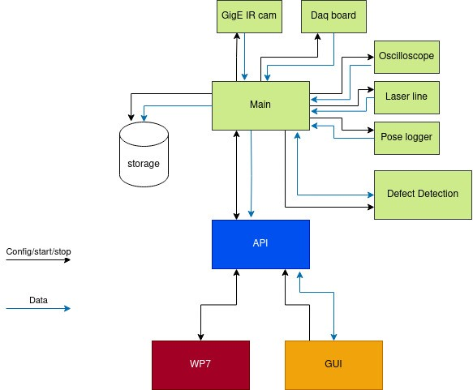
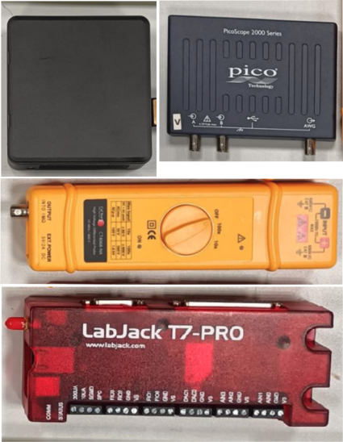
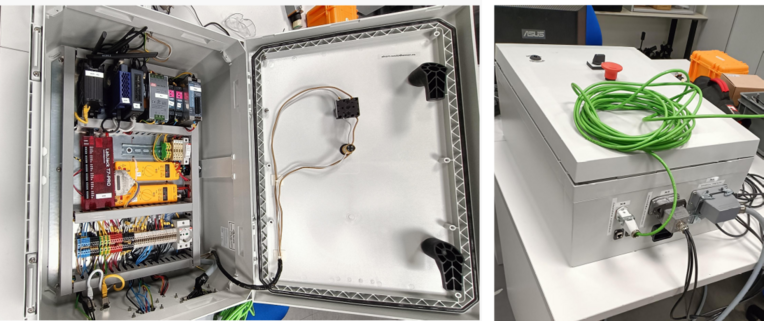
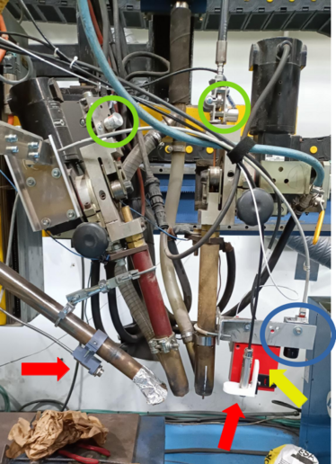

# T6.3 - Welding Process Inspector

## General Description
This solution aims to predict/estimate the presence of defects during the welding process using process parameters monitored in real time. The goal is to reduce the production time and waste when a defective weld occurs. 

It is deployed in two stages. First, several sensors are selected and integrated on the welding torch to obtain a comprehensive monitoring of the welding process. The sensors will look at different process parameters like welding speed, wire feed rate, welding electrical signals, thermal info of bead and base plate… The system will synchronize the data temporally and spatially, creating valuable and complete datasets. 

On a second stage, this data is analyzed and correlated with NDT data to create data models capable to detect high probabilities of defect appearence in real time. The model is deployed following an edge computing paradigm, i.e. next to the monitoring system.

This solution requires specific HW. The data acquisition SW and the defect detection model are embedded in the acquisition HW. The user will have two interfaces: one for the configuration and control of the HW and the other for the offline and detailed visualization of the recorded data.

## Top Ten Functionalities

   1. Welding process monitoring system.
   2. Enables implementation of AI-based quality assurance algorithms.
   3. Early detection of defects: time and scrap reduction in rework tasks.
   4. Flexibility: the monitoring system covers a great variety of sensors and communication protocols (e.g., TCP/IP or Profibus).
   5. Scalability: Ease to add new sensors.
   6. Adaptability: the monitoring system is adaptable to any metallic welding process.
   7. It contributes to the digitalization of the industry.
   8. Set an alarm to stop the process when out of quality limits.
   9. Enables process control.
   10. Provides thermal info from welding bead and base plates.

## Architecture Diagram

- **Internal modules**:
    - *Main*: Synchronizes data acquisition from the different internal modules (sensors, data storage and defect detection algorithms).
    - *GigE IR cam*: This module enables connection to cameras following GigE/genie cam protocols/standards.
    - *DAQ board*: Data Acquisition Board. Acquire digital and analogue signals, e.g., pyrometers.
    - *Oscilloscope*: Aaquires analogue signals at a high sampling frequency, i.e., voltage and current of each welding torches.
    - *Laser line*: retrieves the geometrical data scanned by the laser line profilometer. 
    - *Pose Logger*: Retrieves the position of the welding torches regarding the whole part.
    - *Defect Detection Algorithm*: Analises data stream from sensors and warns when anomalies are identified.
    - *Storage*: Data is saved locally in a custom data format.
- **GUI**: Graphical User Interface. Allows the user to configure the monitoring system and to check the correct operation of the system during welding.
- **API**: SW interface to the monitoring system  

## Image Overview
The present section addresses the user interfaces envisioned to interact with the Welding Process Monitoring solution. Two GUIs are defined, one for configuring all devices involved in the data acquisition which also provides some features for online visualization and another one for offline analysis of the recorded data. 

")

Above figure is a design for the GUI in charge of the HW configuration of ZDZW Welding Inspector the and a subsampled online visualization of the welding process (a.k.a. *recorder app*). On the left side you can see the 3 different formats for the visualization of the data that is being recorded, while the right side is reserved for the configuration of the system and to start/stop the recording. The online visualization includes an image viewer for the IR camera and graph and scalar viewers which allow the user to plot desired parameters. The “configuring input/output interfaces” contains the settings of the sensors that are being used for monitoring the welding process. The “Recorded params” section links the process parameters with the sensor that is being used to get their values. The “metadata” section contains relevant logistic information. The GUI allows the user to enable/disable a defect detection model and to load different models. Finally, the GUI offers a couple of buttons to start and stop the recording manually.

")

Above figure shows the mockup of the GUI for the offline visualization (a.k.a. *visualizer app*). While the *recorder app* offers a restricted, but online, visualization of the monitored data from the welding process, the *visualizer app* allows skilled personnel to analise the recorded data aand visualize it in different formats. The *recorder app* allows the operator to detect disturbances on the welding process or possible mistakes in the configuration of the monitored system, while the *visualizer app* allows a deeper analysis of the recorded data. In addition to the image and graph viewers already available in the *recorder app*, the *visualizer app* also provides a 3D representation of the process parameters.

## Hardware Components

The *Welding Process Inspector* relies on a combination of some specific HW and custom SW. The HW is divided into a CPU, some middle HW for signal processing and the sensors. 

A small factor CPU is chosen for the sake of space economy, but guaranteeing minimum requirements to handle the data acquisition SW and capability to deploy data models based on Deep Learning techniques. 

To capture the detailed waveform of welding currents and voltages we opted for a *PicoScope* USB oscilloscope. When selecting this device, it is vital to ensure the proper number of channels to cover all welding current and voltage signals and a propper bandwidth to guarantee a right sample rate. These parameters may vary depending on the specific welding technique or welding procedure being monitored.

The welding voltage must be pre-processed at the input of the oscilloscope to adapt the voltage amplitude and to isolate the signal to avoid any electromagnetic interference. To that purpose, a differential voltage probe must be selected for each welding voltage signal. The input range must cover the welding voltage range and the differential output range must fit in the oscilloscope input range.

A DAQ (digital acquisition board) processes analog and digital signals to be read by a CPU. In our app we use a *labjack T7* which handle fairly high resolution analog I/O and digital I/O. This particular device has some useful funtionalities as frequency inputs, high speed counters or support to protocols like SPI or I2C among others. The great variety of options of this DAQ contributes to several functionalities of the solution, like the flexibility, adaptability, scalability or the ability to set alarms to stop the welding process when it's out of quality limits, for example.

CPU and intermediate signal processing HW is enclosed in a cabinet alongside other components as power sources or wifi/4G router. The cabinet can be easily installed next to or onto the welding station. Different connectors provide HW interfaces to connect the sensors allocated in the different areas of the welding station by convenient wire hoses.

The sensors must be placed on the welding torch, welding power wire hose and positioning system to acquire the relevant information. Above picture show some typical sensors placed in a Sumerged Arc Welding torch: encoders of wire feed rate (green), pyrometers (red), laser-line profilometer (yellow) and GigE camera (blue).

## Computation Requirements

Below we detail the computation requirements for the user interfaces depicted in [Image Overview](#image-overview) section. 

|    | **minimum** | **recommended** |
| -- | ----------- | --------------- |
**cpu** | 2.60GHz × 6 (i5 11G) | 2.30GHz × 16 (i7 11G)
**ram** | 16 Gb | 32 Gb
**storage**| 512 Gb | > 1 Tb

## Installation Procedure
[
*Step by step on how to install the application:*
* *Standalone*
* *In the Kubernetes platformm using helm charts: description of the different options*
]

TBD

## How To Use
[*Step by step on how to use the application*]

TBD

## Additional Learning Materials
[*Links to other learning materials like youtube tutorials or work from WP10*]

TBD
