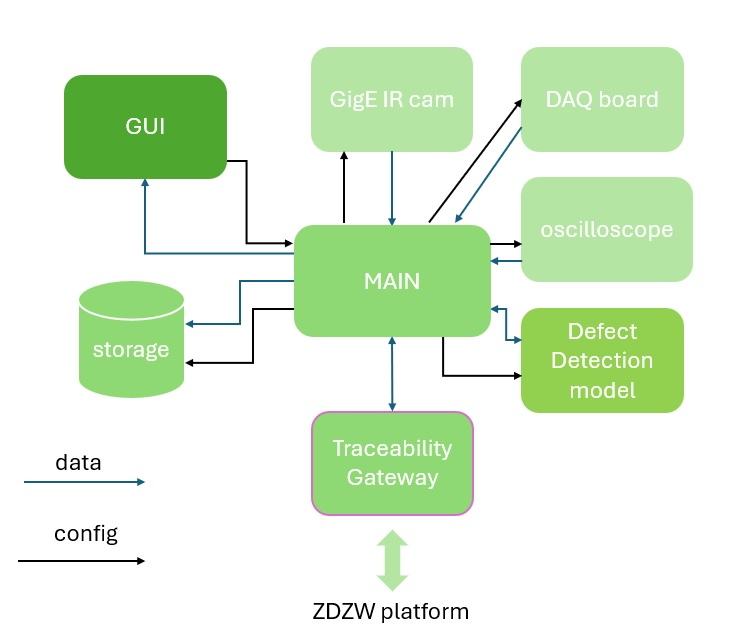
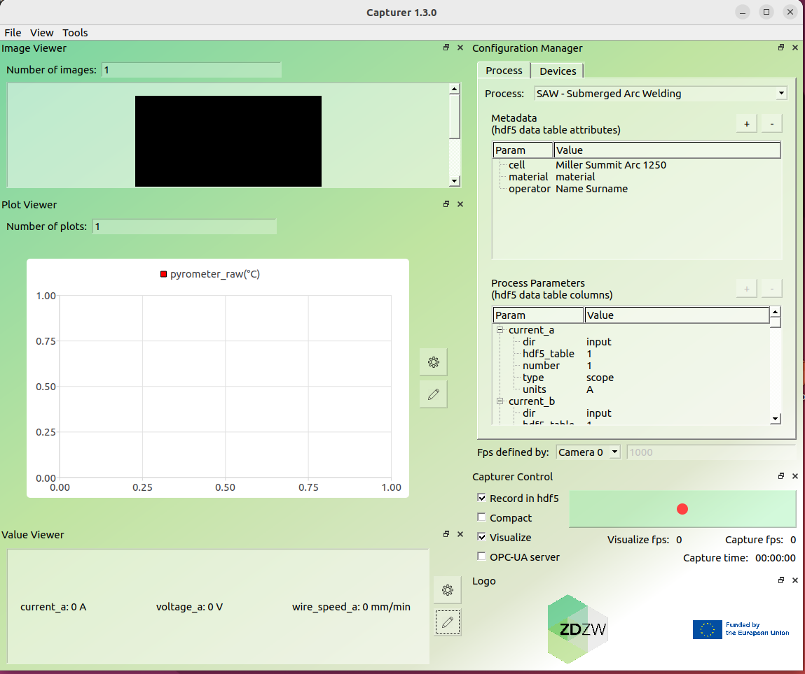
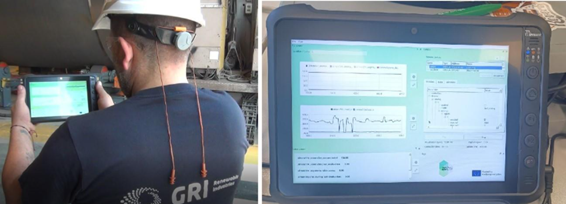
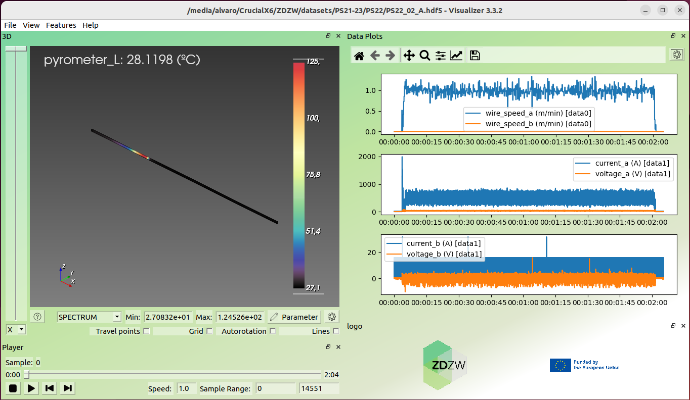
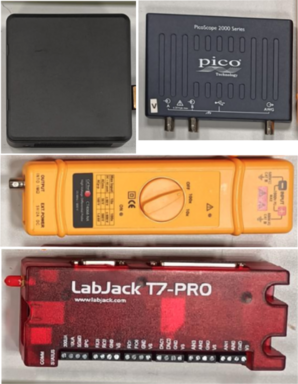
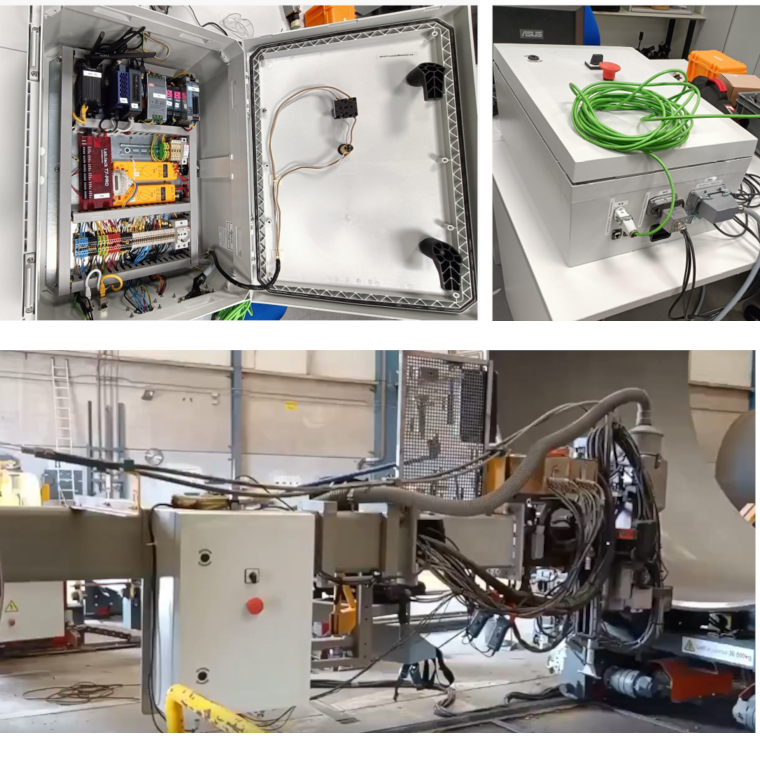

# Welding Process Inspector

## General Description
This solution aims to predict and detect defects during the welding process by continuously monitoring key process parameters in real time. Its main goal is to reduce production time and minimize material waste caused by defective welds.

The system is deployed in two stages. In the first stage, depending on the welding process and the equipment used, a set of sensors is selected and integrated directly on the torch to enable comprehensive process monitoring. These sensors capture parameters such as welding speed, wire feed rate, electrical signals, and thermal data from both the weld bead and the base material. All this data is synchronized to generate high-quality datasets that can be analyzed and linked to common welding defects.

In the second stage, the collected data is combined with Non-Destructive Testing (NDT) results to train models capable of detecting and alerting in real time when there is a high probability of a defect occurring. These models are deployed using an edge computing approach, meaning they run locally, close to the monitoring system for fast response.

The solution includes specific hardware where both the data acquisition software and the defect detection models are embedded. Users interact with the system through two interfaces: one for configuring and managing the hardware, and another for offline access to detailed visualizations of the recorded data.

## Top Ten Functionalities

1. **Welding process monitoring system**: Main feature of the *Welding Process Inspector*. It provides the technical means (HW & SW) to monitorize all relevant parameters of a welding processassutring a good synchroniztion.

2. **Flexibility**: The monitoring system covers a great variety of sensors and communication protocols (e.g., TCP/IP or Profibus).

3. **Adaptability**: The monitoring system is adaptable to any metallic welding process. The sensors and protocols used to monitoring the welding process can be selected for each specific case (i.e. different welding proccesses, different welding stations...)

4. **Scalability**: The system eases to add new sensors. The monitoring HW and SW can be updated and configured to handle a great number of sensors.

5. **Contribution to the digitalization of the industry**: Process variables are digitally acquired and stored. The monitored data can be seen as a kind of digital twin of the welding process, enabling a digital traceability of each welded bead.

6. **Early detection of defects**: The monitoring system collects welding data, which can be used to develop a data-driven model of the welding process. This model is designed to detect when the process deviates from the optimal parameter window and to provide a real-time probability of defect occurrence.

7. **Enables implementation of AI-based quality assurance algorithms**: Both the HW and the SW are designed to implement quality control algorithms, feeding them with real-time processs data.

8. **Possibility to set alarms when out of quality limits**: The *Welding Process Inpector* provides the data processing and the interface required to implement alarms when abnormal process behaviours are being produced.

9. **Enables process control**: The *Welding Process Inpector* furnishes further data to understand reality of the welding process and provides the interfaces with the process to test/implement closed-loop control strategies.

10. **Thermal info from welding bead and base plates**: The system can record images from IR cameras using GeniCam standard. Also, punctual pyrometers contribute to gather thermal information.

## Architecture Diagram

- **Internal modules**:
    - *Main*: Synchronizes data acquisition from the different internal modules (sensors, data storage and defect detection algorithms).
    - *GigE IR cam*: This module enables connection to cameras following GigE/genie cam protocols/standards.
    - *DAQ board*: Data Acquisition Board. Acquire digital and analogue signals, e.g., pyrometers.
    - *Oscilloscope*: Acquires analogue signals at a high sampling frequency, i.e., voltage and current of each welding torches.
    - *Defect Detection Algorithm*: Analises data stream from sensors and warns when anomalies are identified.
    - *Storage*: Data is saved locally in a custom data format.
- **GUI**: Graphical User Interface. Allows the user to configure the monitoring system and to check the correct operation of the system during welding.
- **Traceability Gateway**: The system uses the ZDZW Traceability Gateway to comunicate with the ZDZW platform. 

## Image Overview
The present section addresses the user interfaces envisioned to interact with the Welding Process Monitoring solution. Two GUIs are defined, one for configuring all devices involved in the data acquisition which also provides some features for online visualization and another one for offline analysis of the recorded data.

Above figure shows the GUI in charge of the HW configuration of *ZDZW Welding Process Inspector* and a subsampled online visualization of the welding process (a.k.a. *capturer app*). On the left side you can see the 3 different formats for the visualization of the data that is being recorded, while the right side is reserved for the configuration of the system and to start/stop the recording. The online visualization includes an image viewer for the IR camera and graph and scalar viewers which allow the user to plot desired parameters. The “configuring input/output interfaces” contains the settings of the sensors that are being used for monitoring the welding process. The “Recorded params” section links the process parameters with the sensor that is being used to get their values. The “metadata” section contains relevant logistic information. The GUI allows the user to enable/disable a defect detection model and to load different models. Finally, the GUI offers a couple of buttons to start and stop the recording manually.

Above figure shows the mockup of the GUI for the offline visualization (a.k.a. *visualizer app*). While the *capturer app* offers a restricted, but online, visualization of the monitored data from the welding process, the *visualizer app* allows skilled personnel to analise the recorded data and visualize it in different formats. The *capturer app* allows the operator to detect disturbances on the welding process or possible mistakes in the configuration of the monitored system, while the *visualizer app* allows a deeper analysis of the recorded data. In addition to the image and graph viewers already available in the *capturer app*, the *visualizer app* also provides a 3D representation of the process parameters.

## Hardware Components

The *Welding Process Inspector* relies on a combination of some specific HW and custom SW. The HW is divided into a CPU, some middle HW for signal processing and the sensors.

A small factor CPU is chosen for the sake of space economy, but guaranteeing minimum requirements to handle the data acquisition SW and capability to deploy data models based on Deep Learning techniques.

To capture the detailed waveform of welding currents and voltages we opted for a *PicoScope* USB oscilloscope. When selecting this device, it is vital to ensure the proper number of channels to cover all welding current and voltage signals and a propper bandwidth to guarantee a right sample rate. These parameters may vary depending on the specific welding technique being monitored.

The welding voltage must be pre-processed at the input of the oscilloscope to adapt the voltage amplitude and to isolate the signal to avoid any electromagnetic interference. To that purpose, a differential voltage probe must be selected for each welding voltage signal. The input range must cover the welding voltage range and the differential output range must fit in the oscilloscope input range.

A DAQ (digital acquisition board) processes analog and digital signals to be read by a CPU. In our app we use a *labjack T7* which handle fairly high resolution analog I/O and digital I/O. This particular device has some useful funtionalities as frequency inputs, high speed counters or support to protocols like SPI or I2C among others. The great variety of options of this DAQ contributes to several functionalities of the solution, like the flexibility, adaptability, scalability or the ability to set alarms to stop the welding process when it's out of quality limits, for example.

CPU and intermediate signal processing HW is enclosed in a cabinet alongside other components as power sources or wifi/4G router. The cabinet can be easily installed next to or onto the welding station. Different connectors provide HW interfaces to connect the sensors allocated in the different areas of the welding station by convenient wire hoses.

The sensors must be placed on the welding torch, welding power wire hose and positioning system to acquire the relevant information. Above picture show some typical sensors placed in a Sumerged Arc Welding torch: encoders for wire feed rate (green), pyrometers (red), laser-line profilometer (yellow) and GigE camera (blue).

## Computation Requirements

Below we detail the computation requirements for the user interfaces depicted in [Image Overview](#image-overview) section.

|    | **minimum** | **recommended** |
| -- | ----------- | --------------- |
**cpu** | 2.60GHz × 6 (i5 11G) | 2.30GHz × 16 (i7 11G)
**ram** | 16 Gb | 32 Gb
**storage**| 512 Gb | > 1 Tb

## Installation Procedure
One important point of the present solution is that is highly adpatable to the welding process and welding equipment of the client. Most of the SW would be provided to the client pre-installed in the HW selected for the specific use case. The SW interfaces to interact with the system are provided as standalone program files.

## How To Use
The welding operator should have access to a tablet or touch screen with *capturer app*. From this GUI, they can connect with the Welding Process Inspector and check the configuration of all sensors. Defect detection models are preloaded by manufacturer. From the GUI, operator can start and stop the welding monitoring and configure wich welding parameters and alerts visualize. When high probability of defects appearance is detected, alarmas are displayed to operator.

Offline *visualizer app* would be only used by specialized personnel to deep analysis of recorded data, in case needed. 

## Links

- [Introduction 1](https://www.youtube.com/watch?v=33Q-c82fChw)
- [Introduction 2](https://www.youtube.com/watch?v=-0fFijQJMHg)
- [Demo](https://www.youtube.com/watch?v=vxUo37tsmHA)
- [webinar: AI-Supported Monitoring System for Defect Detection in Submerged Arc Welding](https://www.youtube.com/watch?v=otOrKbyybMQ)

